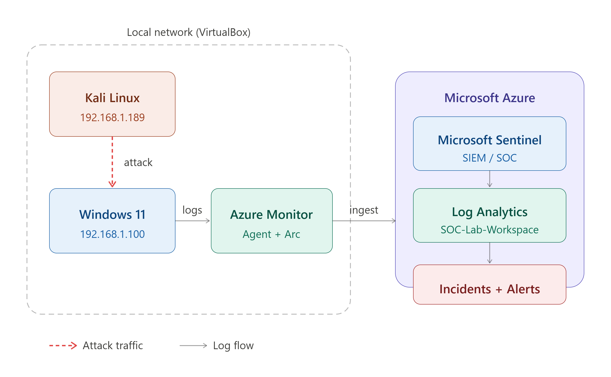
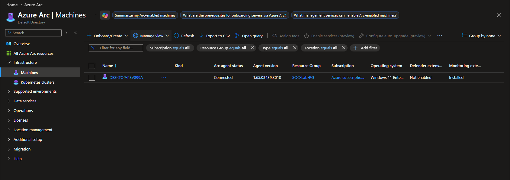
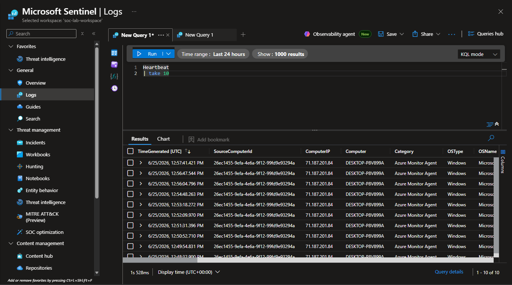
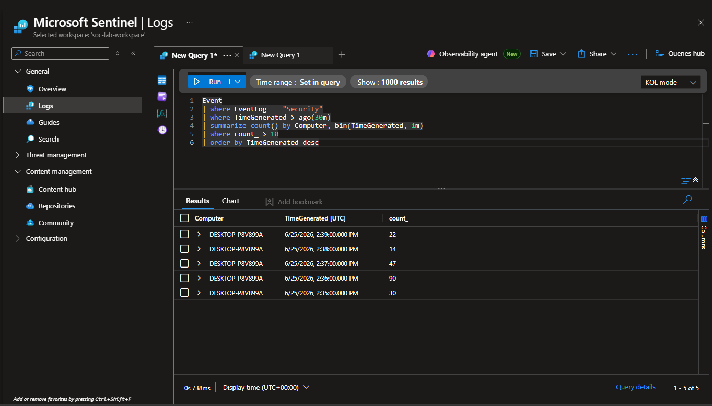
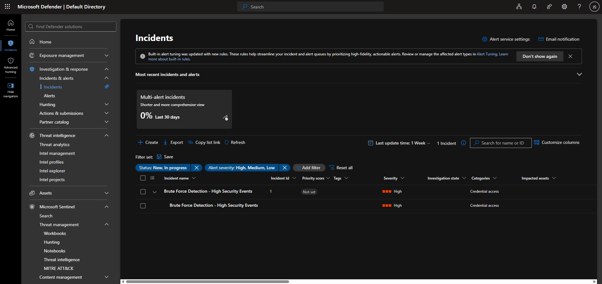

# 🛡️ Home SOC Lab - Microsoft Sentinel

## Project Overview
A fully functional Security Operations Center (SOC) lab built to demonstrate hands-on cybersecurity skills for SOC Analyst roles. This project covers real-world attack simulation, detection engineering, and incident response using Microsoft Sentinel.

## 🏗️ Architecture


- **Attacker:** Kali Linux VM (192.168.1.189)
- **Target:** Windows 11 Enterprise VM (192.168.1.100)
- **SIEM:** Microsoft Sentinel (Azure - East US)
- **Log Collection:** Azure Monitor Agent via Azure Arc

## 🔧 Tools & Technologies
- Microsoft Sentinel
- Azure Arc
- Azure Monitor Agent
- Kali Linux
- Hydra (Brute Force)
- Nmap (Port Scanning)
- KQL (Kusto Query Language)
- VirtualBox

## ⚔️ Attack Scenarios
### 1. SMB Brute Force Attack
- Tool: Hydra
- Target: Windows 11 SMB (Port 445)
- Detection: High volume security events (>10/min)
- Severity: High

## 📊 Detection Rules (KQL)
### Brute Force Detection
```kql
Event
| where EventLog == "Security"
| summarize count() by Computer, bin(TimeGenerated, 1m)
| where count_ > 10
```

## 🚨 Incidents Detected
| Incident | Severity | Category | Status |
|----------|----------|----------|--------|
| Brute Force Detection - High Security Events | High | Credential Access | Detected |

## 📸 Screenshots
### 1. Architecture Diagram


### 2. VM Connected to Azure (Azure Arc)


### 3. VM Sending Heartbeat to Sentinel


### 4. Brute Force Attack Detected (KQL)


### 5. High Severity Incidents Created


## 🔁 How to Reproduce
1. Create Azure free account and enable Microsoft Sentinel
2. Install VirtualBox with Kali Linux and Windows 11 VMs
3. Connect Windows 11 to Azure via Azure Arc
4. Install Azure Monitor Agent and configure Data Collection Rule
5. Run Hydra brute force from Kali: `hydra -l admin -P rockyou.txt <target-ip> smb`
6. Monitor incidents in Microsoft Sentinel

## 🎓 Certifications
- SC-900: Microsoft Security Fundamentals (In Progress)
- AZ-500: Microsoft Azure Security Technologies (Planned)

## 💡 What I Learned
- Deploying and configuring Microsoft Sentinel as a SIEM
- Connecting on-premises VMs to Azure via Azure Arc
- Writing KQL detection rules for threat hunting
- Simulating real-world attacks using Hydra and Nmap
- Analyzing security incidents as a SOC analyst
